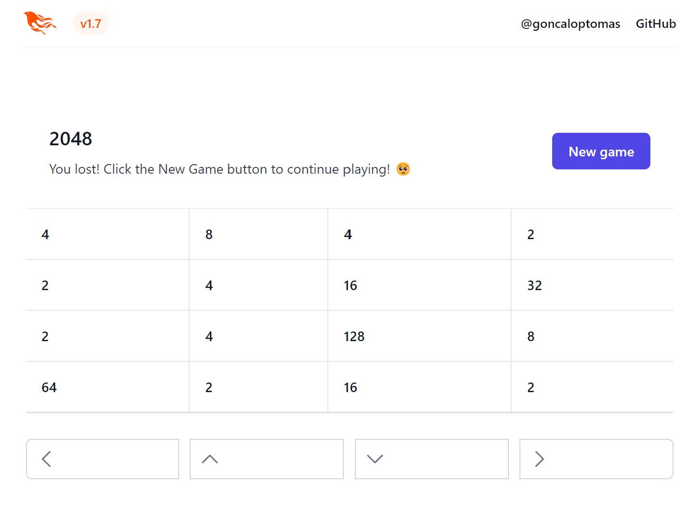

# TwentyFortyeight


This project was generated with the following command:
```shell
mix phx.new twenty_fortyeight --no-ecto --no-dashboard --no-gettext --no-mailer --no-html --live
```

This 2048 game uses Phoenix 1.7 Release Candidate along with LiveView 0.18.3 and TailwindCSS.

## Instructions on how to run the code:

  * Clone the repository and install dependencies with `mix deps.get`
  * Start Phoenix endpoint with `mix phx.server` or inside IEx with `iex -S mix phx.server`

Open [`localhost:4000`](http://localhost:4000) on a local browser.
